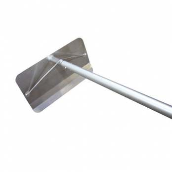

snowpull
========

__A lambda function that runs in [AWS Lambda](http://aws.amazon.com/lambda/)__

1. triggered by incoming [snowball](https://github.com/secretagentsnowman/snowball) queue
2. Forwards messages to lambda function (snowpack)[https://github.com/secretagentsnowman/snowpack]

- Pulls messages from [Amazon Simple Queue Service (SQS)](http://aws.amazon.com/sqs/)
- Forwards messages to lambda function [snowpack](https://github.com/secretagentsnowman/snowpack) for augmentation..
- Batch deletes handled messages from the queue.

